# Protocol Library - Advanced Features Guide

## Table of Contents
1. [Feature 1: Protocol Execution Mode](#feature-1-protocol-execution-mode)
2. [Feature 2: Protocol Versioning & History](#feature-2-protocol-versioning--history)
3. [Feature 3: Smart Inventory Integration](#feature-3-smart-inventory-integration)
4. [Feature 4: Collaboration Features](#feature-4-collaboration-features)
5. [Feature 5: Media Attachments](#feature-5-media-attachments)
6. [Feature 6: Approval Workflow](#feature-6-approval-workflow)
7. [Feature 7: Training & Certification](#feature-7-training--certification)
8. [Feature 8: Analytics Dashboard](#feature-8-analytics-dashboard)
9. [Feature 9: Scheduling & Resource Planning](#feature-9-scheduling--resource-planning)
10. [Feature 10: Compliance & Audit](#feature-10-compliance--audit)
11. [Suggested Additional Features](#suggested-additional-features)

---

## Feature 1: Protocol Execution Mode

### Overview
Full-screen guided execution mode with step-by-step instructions, timers, and documentation capabilities.

### Flow Diagram

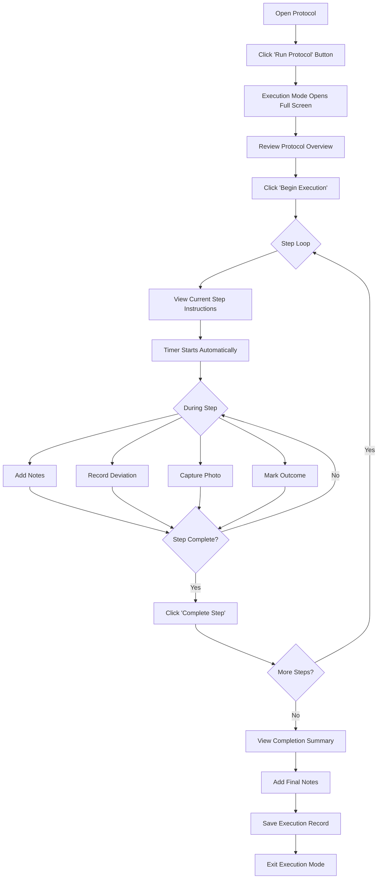

### How to Use

1. **Starting Execution**
   - Open any protocol from the Protocol Library
   - Click the green "Run Protocol" button in the header
   - Review the protocol overview (name, version, estimated time)
   - Click "Begin Execution" to start

2. **During Each Step**
   - Read the step instructions carefully
   - Timer automatically tracks duration (countdown if step has estimated time)
   - Use the notes field to document observations
   - If deviating from protocol, document in the "Deviation" field
   - Mark outcome: Success, Partial, or Failed

3. **Completing Execution**
   - After all steps, review the completion summary
   - See total time, steps completed, any deviations
   - Add final notes
   - Click "Complete & Exit" to save the execution record

### Key Features
- Automatic timer per step
- Deviation tracking with reasons
- Photo capture capability
- Step-by-step progress indicator
- Pause/Resume support
- Abort with reason option

---

## Feature 2: Protocol Versioning & History

### Overview
Track all changes to protocols with version control, diff comparison, and rollback capabilities.

### Flow Diagram

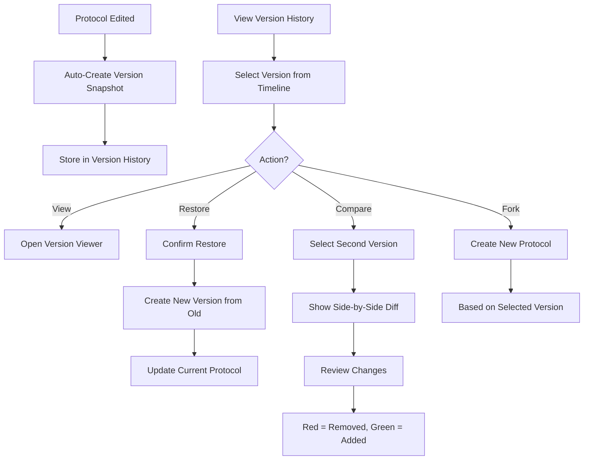

### How to Use

1. **Viewing History**
   - Open protocol detail drawer
   - Go to "History" tab
   - See timeline of all versions with dates and authors

2. **Comparing Versions**
   - Click "Compare" on any version
   - Select another version to compare against
   - View side-by-side diff with highlighted changes
   - Red text = removed content
   - Green text = added content

3. **Restoring Versions**
   - Click "Restore" on desired version
   - Confirm the action
   - Current protocol reverts to that version
   - A new version entry is created for the restore action

4. **Forking**
   - Click "Fork" to create a new protocol based on any version
   - Useful for creating variations without affecting original

---

## Feature 3: Smart Inventory Integration

### Overview
Link protocol reagents to lab inventory, check availability before execution, and auto-deduct quantities.

### Flow Diagram

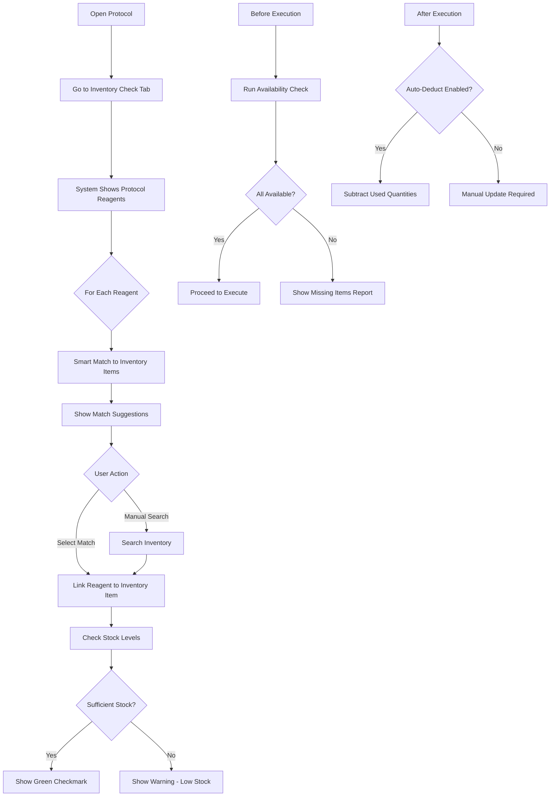

### How to Use

1. **Linking Reagents**
   - Open protocol and go to "Inventory" tab
   - System automatically suggests matches for each reagent
   - Click on suggestion to link, or search manually
   - Linked items show current stock levels

2. **Checking Availability**
   - Click "Check Availability" before starting protocol
   - Green = sufficient stock
   - Yellow = low stock warning
   - Red = insufficient or expired

3. **Auto-Deduct Setup**
   - Enable "Auto-deduct after execution" toggle
   - Specify quantities used per step
   - After completing execution, inventory automatically updates

4. **Handling Shortages**
   - System alerts when items are insufficient
   - View alternative items if available
   - Create purchase request directly from the interface

---

## Feature 4: Collaboration Features

### Overview
Team collaboration with comments, @mentions, and threaded discussions on protocols.

### Flow Diagram

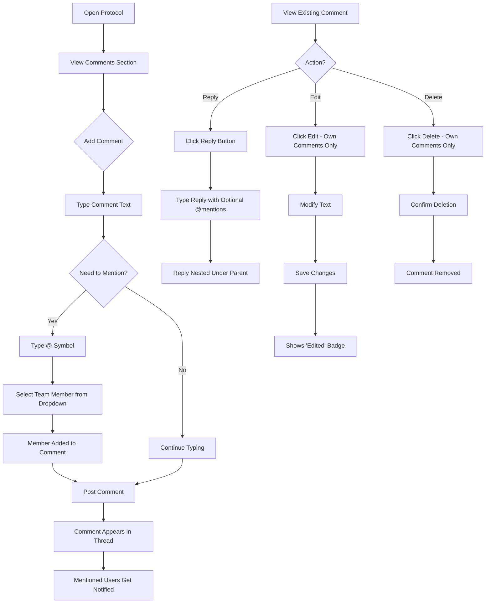

### How to Use

1. **Adding Comments**
   - Scroll to Discussion section in protocol
   - Type your comment in the text area
   - Use @ to mention team members (dropdown appears)
   - Click "Post Comment"

2. **Mentioning Team Members**
   - Type @ followed by name
   - Select from autocomplete dropdown
   - Mentioned users receive notifications
   - Their names appear highlighted in comments

3. **Replying to Comments**
   - Click "Reply" under any comment
   - Reply appears nested under original
   - Can include @mentions in replies

4. **Managing Comments**
   - Edit your own comments (shows "edited" badge)
   - Delete your own comments
   - Step-specific comments link to protocol steps

---

## Feature 5: Media Attachments

### Overview
Upload images, videos, and documents with annotation capabilities for visual protocols.

### Flow Diagram

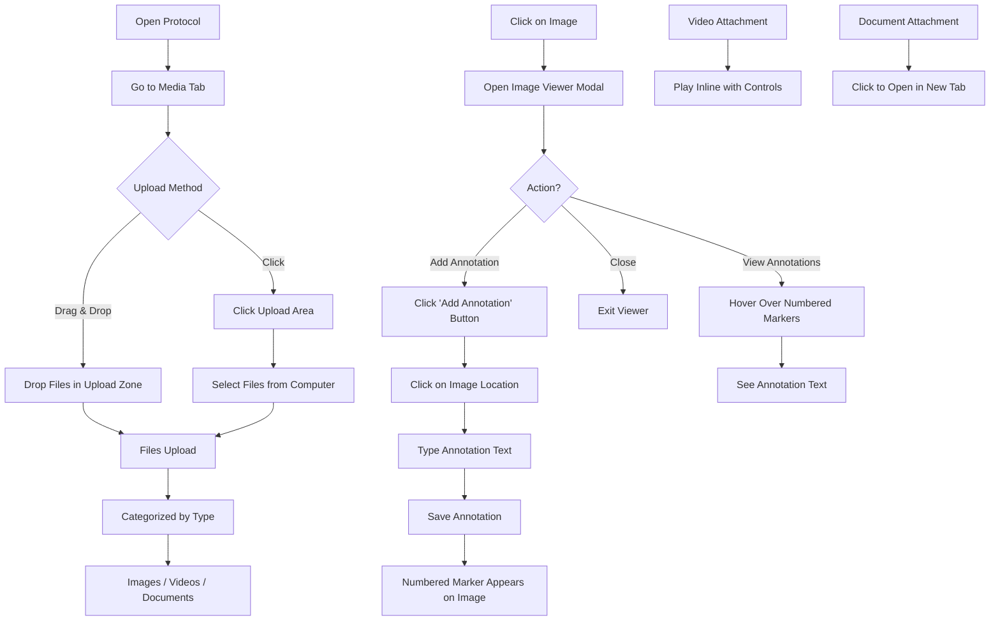

### How to Use

1. **Uploading Files**
   - Go to "Attachments" tab in protocol
   - Drag & drop files or click to browse
   - Supports: Images (PNG, JPG), Videos (MP4), PDFs
   - Maximum file size: 50MB

2. **Viewing Media**
   - Images: Click thumbnail to open full viewer
   - Videos: Play inline with video controls
   - Documents: Click to open in new browser tab

3. **Adding Image Annotations**
   - Open image in viewer
   - Click "Add Annotation" button
   - Click on the image where you want to annotate
   - Type annotation text (e.g., "Check temperature here")
   - Click Save
   - Numbered marker appears at that location

4. **Linking to Steps**
   - When uploading, select associated step number
   - Media appears linked to that step during execution
   - Helps provide visual guidance per step

---

## Feature 6: Approval Workflow

### Overview
Multi-reviewer approval system with electronic signatures for regulatory compliance (21 CFR Part 11).

### Flow Diagram

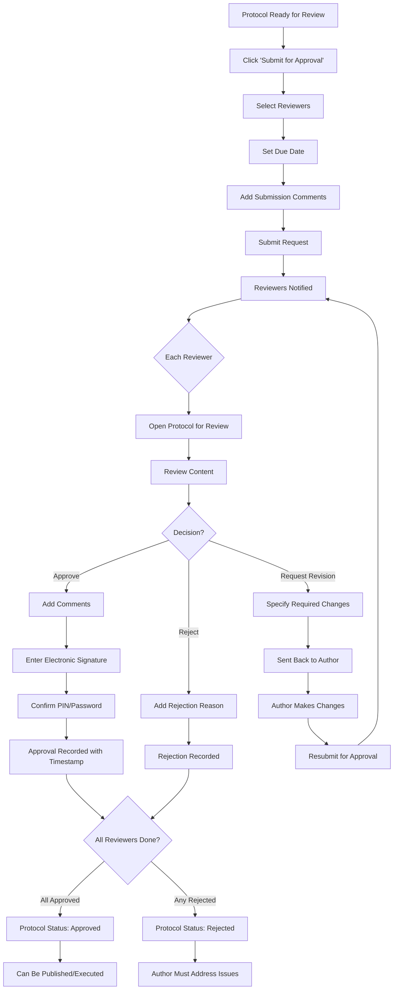

### How to Use

1. **Submitting for Approval**
   - Open protocol in Draft status
   - Click "Submit for Approval" button
   - Select required reviewers (can select multiple)
   - Set optional due date
   - Add any comments for reviewers
   - Submit

2. **Reviewing a Protocol (as Reviewer)**
   - Receive notification of pending review
   - Open protocol to review content
   - Choose action:
     - **Approve**: Add comments, sign electronically
     - **Reject**: Provide rejection reason
     - **Request Revision**: Specify what needs to change

3. **Electronic Signatures**
   - Required for approvals (21 CFR Part 11 compliance)
   - Enter your signature phrase
   - Confirm with PIN/password
   - Timestamp and signature recorded immutably

4. **Tracking Status**
   - View approval progress in real-time
   - See who has approved/rejected/pending
   - Timeline shows all approval activity

---

## Feature 7: Training & Certification

### Overview
Track who is trained on each protocol, manage certifications, and ensure compliance before execution.

### Flow Diagram

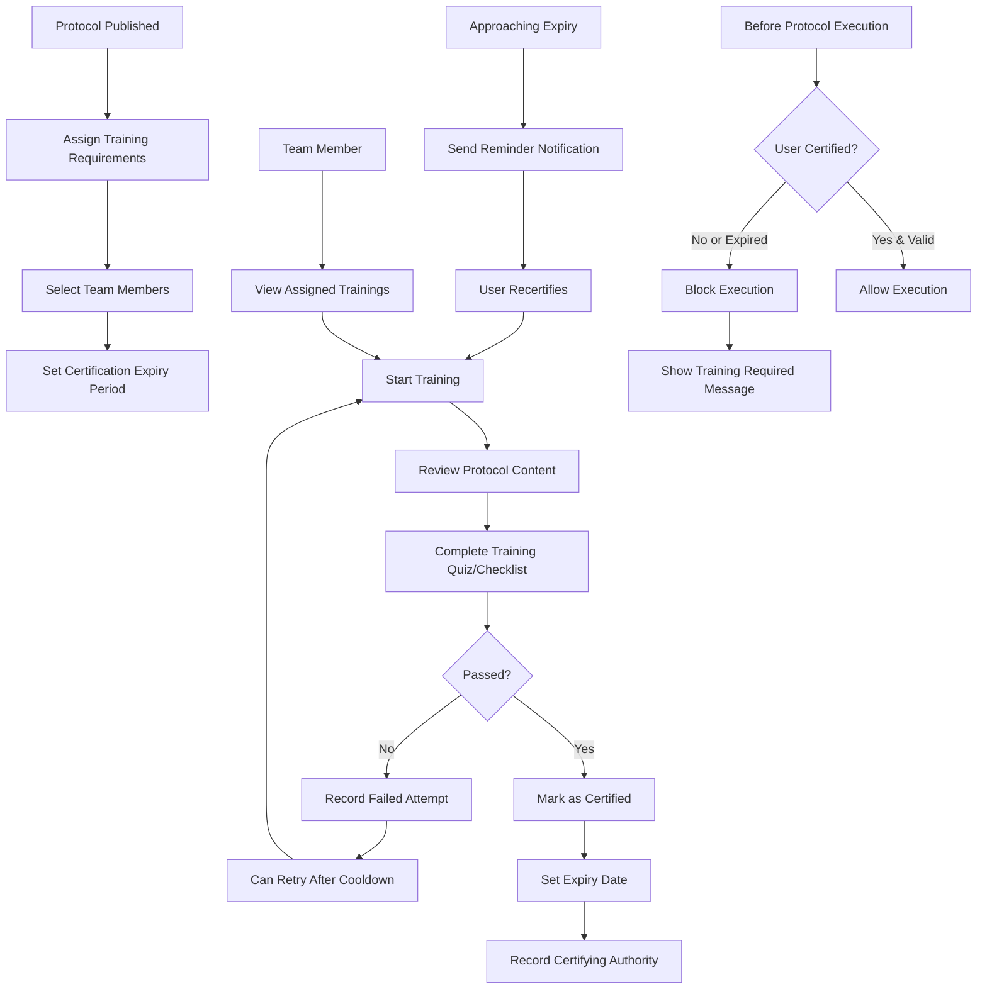

### How to Use

1. **Assigning Training**
   - Go to "Training" tab in protocol
   - Click "Assign Training"
   - Select team members who need certification
   - Set expiry period (e.g., 12 months)
   - Click Assign

2. **Completing Training (as Trainee)**
   - View your assigned trainings in Training tab
   - Click "Start Training"
   - Review protocol content thoroughly
   - Complete any required assessment
   - Submit for certification

3. **Certifying Users (as Trainer/Supervisor)**
   - View completed trainings awaiting certification
   - Review trainee's assessment results
   - Click "Certify" to grant certification
   - Add notes if needed

4. **Managing Expirations**
   - Dashboard shows upcoming expirations
   - Filter by: Certified, In Progress, Expired
   - System sends automatic reminders before expiry
   - Users must recertify to continue executing protocol

---

## Feature 8: Analytics Dashboard

### Overview
Comprehensive analytics on protocol usage, performance metrics, and execution statistics.

### Flow Diagram

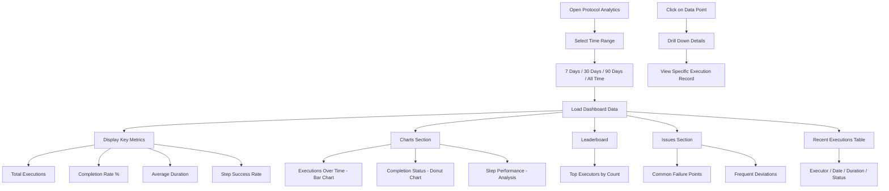

### How to Use

1. **Accessing Analytics**
   - Open protocol detail drawer
   - Go to "Analytics" tab
   - Dashboard loads automatically

2. **Understanding Metrics**
   - **Total Executions**: Number of times protocol was run
   - **Completion Rate**: % of executions completed successfully
   - **Average Duration**: Mean time to complete protocol
   - **Step Success Rate**: % of steps completed without issues

3. **Using Charts**
   - **Bar Chart**: Shows execution trends over time
   - **Donut Chart**: Breakdown of completion vs. incomplete
   - Hover for exact values

4. **Analyzing Performance**
   - View step-by-step performance metrics
   - Identify bottleneck steps (longest duration)
   - See which steps have most deviations
   - Track common failure reasons

5. **Top Executors**
   - See who runs this protocol most often
   - Useful for identifying subject matter experts
   - Can assign as trainers/reviewers

---

## Feature 9: Scheduling & Resource Planning

### Overview
Schedule protocol runs, manage equipment availability, and prevent resource conflicts.

### Flow Diagram

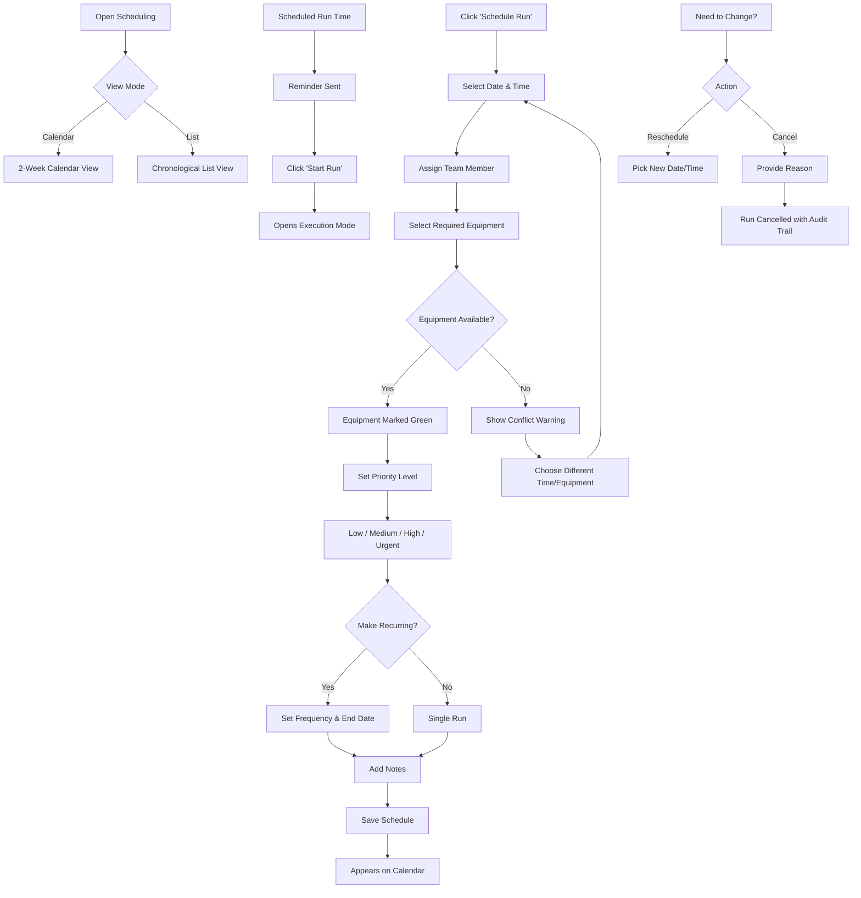

### How to Use

1. **Viewing Schedule**
   - Open "Scheduling" section
   - Toggle between Calendar and List views
   - Calendar shows 2-week overview
   - List shows all upcoming runs

2. **Scheduling a Run**
   - Click "Schedule Run" button
   - Select date and time
   - Assign to team member
   - Select required equipment
   - Check for conflicts (highlighted in red)
   - Set priority (affects notification urgency)
   - Add any notes
   - Click Schedule

3. **Recurring Schedules**
   - Enable "Make recurring" checkbox
   - Set frequency: Daily/Weekly/Monthly
   - Set interval (e.g., every 2 weeks)
   - Set end date or leave open-ended
   - System creates all occurrences

4. **Managing Equipment**
   - View equipment availability panel
   - Green dot = available today
   - Red dot = booked
   - See booking times for each equipment

5. **Handling Conflicts**
   - System warns about:
     - Equipment double-booking
     - Assignee not available
     - Overlapping protocol runs
   - Resolve before scheduling

6. **Starting Scheduled Runs**
   - Get reminder notification
   - Click "Start Run" from schedule
   - Directly opens Execution Mode

---

## Feature 10: Compliance & Audit

### Overview
Full audit trail, deviation tracking, and compliance reporting for regulatory requirements.

### Flow Diagram

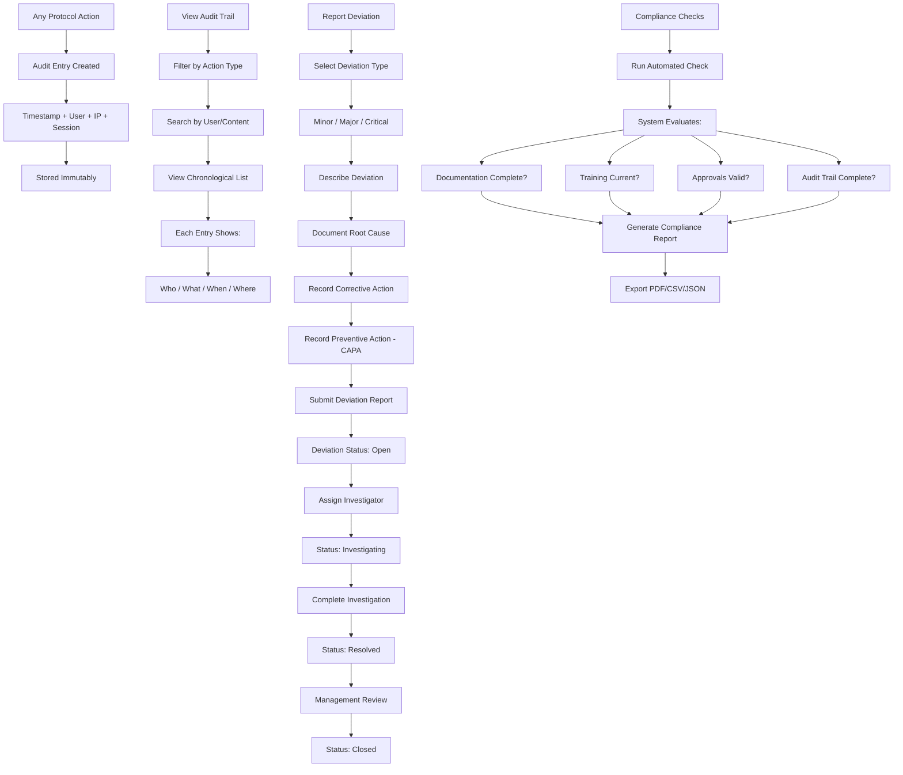

### How to Use

1. **Viewing Audit Trail**
   - Go to "Compliance" tab in protocol
   - "Audit Trail" section shows all events
   - Filter by action type (edit, approve, execute, etc.)
   - Search by user name or content
   - Each entry shows:
     - Action icon and type
     - User name and role
     - Detailed description
     - Timestamp with timezone
     - IP address and session ID

2. **Reporting Deviations**
   - Click "Report Deviation" button
   - Select severity: Minor/Major/Critical
   - Enter execution ID and step number
   - Describe what deviated from expected
   - Document root cause (if known)
   - Record corrective action taken
   - Record preventive action (CAPA)
   - Submit

3. **Managing Deviations**
   - View all deviations by status
   - Status flow: Open → Investigating → Resolved → Closed
   - Each status change is audited
   - Critical deviations highlighted
   - Track resolution time

4. **Compliance Checks**
   - Click "Run Check" to evaluate compliance
   - System checks:
     - Documentation completeness
     - Training currency
     - Approval validity
     - Version control
     - Audit trail integrity
   - Results show: Compliant / Non-Compliant / Needs Review

5. **Exporting Reports**
   - Click "Export Report"
   - Choose format: PDF, CSV, or JSON
   - Report includes:
     - Complete audit trail
     - Deviation summary
     - Compliance status
     - Signatures and timestamps

---

## Suggested Additional Features

Here are advanced features to further enhance the Protocol Library:

### Feature 11: AI-Powered Protocol Assistant

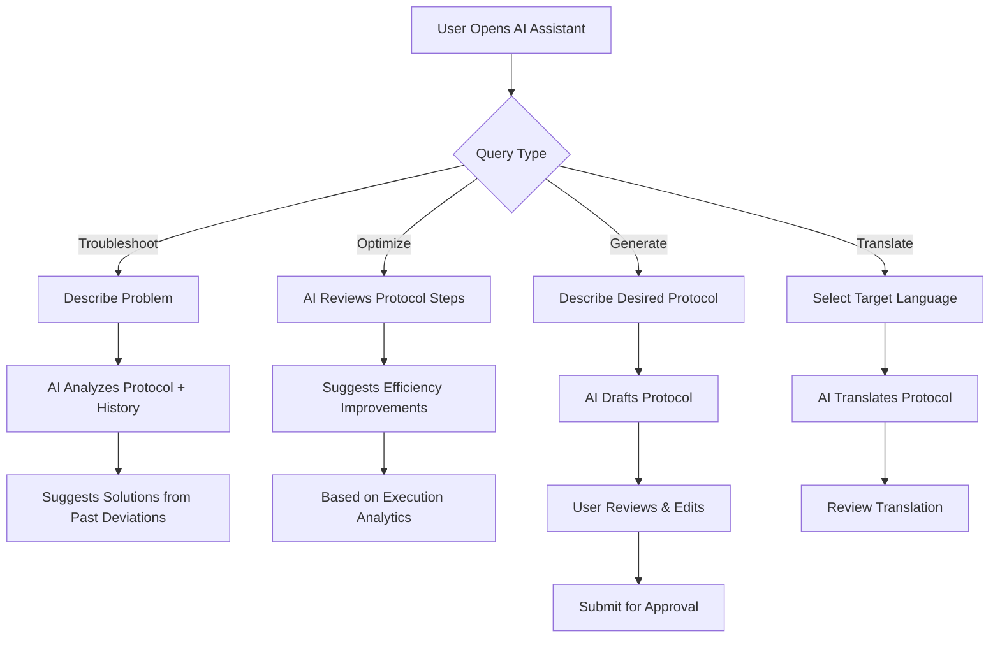

**Capabilities:**
- Natural language troubleshooting
- Protocol optimization suggestions based on execution data
- Auto-generate protocols from descriptions
- Multi-language translation
- Safety hazard detection

### Feature 12: Integration Hub

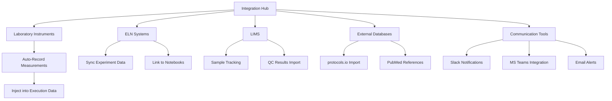

**Integrations:**
- Lab instruments (auto-capture measurements)
- ELN (Electronic Lab Notebook)
- LIMS (Laboratory Information Management System)
- protocols.io / Bio-Protocol import
- Slack/Teams notifications

### Feature 13: Mobile Execution App

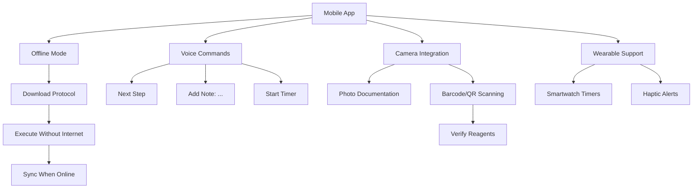

**Features:**
- Offline protocol execution
- Voice command support
- Camera for photo documentation
- Barcode scanning for reagent verification
- Smartwatch integration for hands-free alerts

### Feature 14: Protocol Simulation & Dry Run

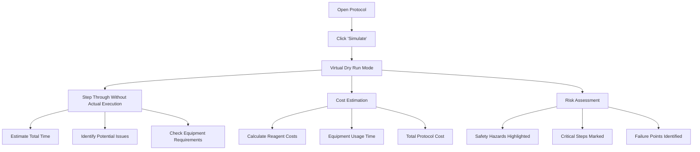

**Features:**
- Virtual walkthrough without consuming resources
- Time estimation with variability
- Cost calculation (reagents + equipment)
- Risk assessment highlighting
- Training mode for new users

### Feature 15: Advanced Branching & Decision Trees

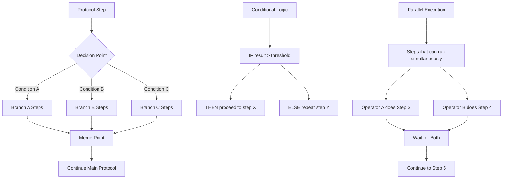

**Features:**
- Conditional branching based on results
- Decision trees for troubleshooting
- Parallel step execution
- Loop structures (repeat until condition)
- Dynamic step insertion

### Feature 16: Cross-Protocol Dependencies

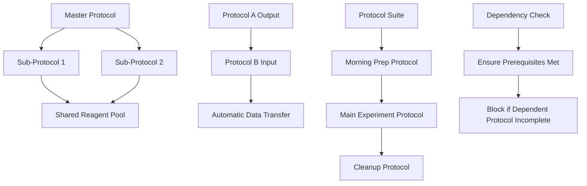

**Features:**
- Link protocols as sub-protocols
- Share reagents/equipment across protocols
- Output of one feeds into another
- Protocol suites (sequences)
- Dependency validation

### Feature 17: Real-Time Collaboration

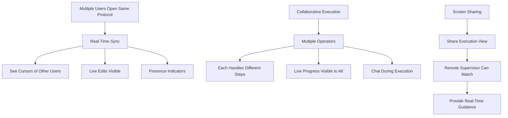

**Features:**
- Multi-user simultaneous editing
- Cursor presence (see who's viewing what)
- Real-time step updates during execution
- In-app chat/voice during execution
- Screen sharing for remote supervision

### Feature 18: Predictive Maintenance Alerts

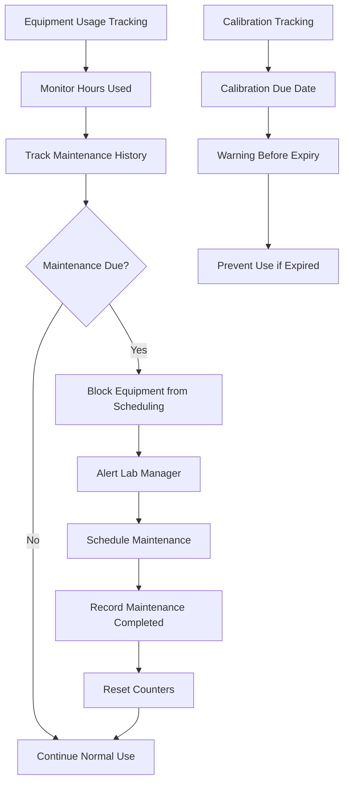

**Features:**
- Track equipment usage hours
- Predict maintenance needs
- Calibration due date tracking
- Auto-block expired/uncalibrated equipment
- Maintenance scheduling integration

---

## Implementation Priority Matrix

| Feature | Impact | Effort | Priority |
|---------|--------|--------|----------|
| AI Assistant | High | High | Medium |
| Integration Hub | High | Medium | High |
| Mobile App | High | High | Medium |
| Simulation/Dry Run | Medium | Low | High |
| Branching Logic | Medium | Medium | Medium |
| Cross-Protocol Deps | Medium | Medium | Low |
| Real-Time Collab | Medium | High | Low |
| Predictive Maintenance | Low | Medium | Low |

---

## Quick Start Guide

### For Lab Researchers

1. **Find a Protocol**: Use search or browse categories
2. **Check Availability**: Verify reagents in inventory
3. **Schedule Run**: Book time and equipment
4. **Execute**: Use guided execution mode
5. **Document**: Add notes and photos during execution

### For Lab Managers

1. **Approve Protocols**: Review and sign off on new protocols
2. **Assign Training**: Ensure team is certified
3. **Monitor Compliance**: Review audit trail and deviations
4. **Analyze Performance**: Use analytics to optimize

### For Quality/Compliance

1. **Run Compliance Checks**: Verify regulatory requirements
2. **Investigate Deviations**: Follow CAPA process
3. **Export Reports**: Generate audit documentation
4. **Review Approvals**: Ensure proper signatures

---

## Support

For questions or issues:
- Check the troubleshooting section in each feature
- Contact lab-support@yourorg.com
- Submit issues via the in-app feedback system
